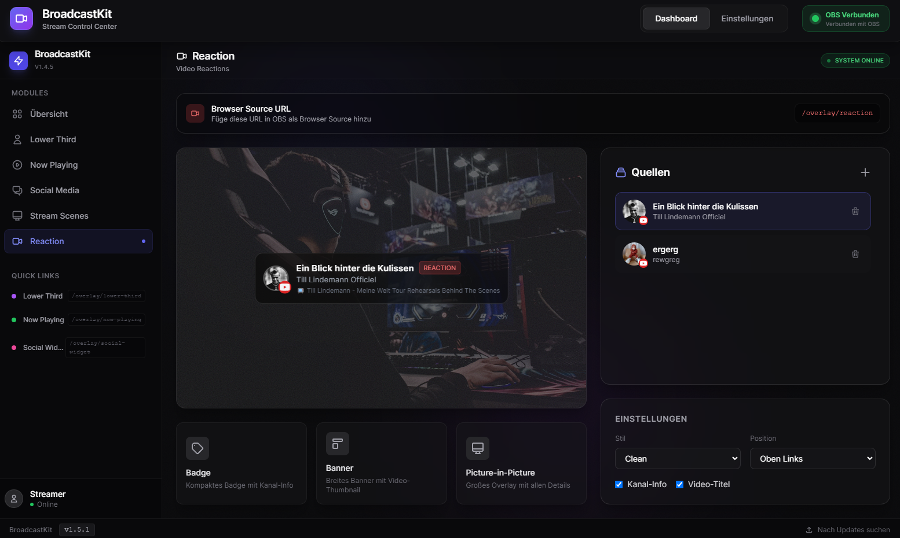

<p align="center">
  
</p>

<p align="center">
  <strong>🎬 Professionelle Stream Overlays für OBS Studio</strong>
</p>

<p align="center">
  <a href="https://github.com/netz-sg/broadcastkit/releases/latest">
    
  </a>
  <a href="https://github.com/netz-sg/broadcastkit/releases">
    
  </a>
  <a href="https://github.com/netz-sg/broadcastkit/blob/main/LICENSE">
    
  </a>
  <a href="https://github.com/netz-sg/broadcastkit/stargazers">
    
  </a>
</p>

<p align="center">
  <a href="#-features">Features</a> •
  <a href="#-installation">Installation</a> •
  <a href="#-overlays">Overlays</a> •
  <a href="#-screenshots">Screenshots</a> •
  <a href="#-roadmap">Roadmap</a>
</p>

---

## ✨ Features

<table>
<tr>
<td width="50%">

### 🎯 Lower Third Overlay
Professionelle Namenseinblendungen mit **3 Styles**:
- **Clean Pro** - Modern & Minimalistisch
- **Broadcast News** - TV-Style mit Live-Indikator
- **Esports HUD** - Gaming-Look mit Glitch-Effekten

</td>
<td width="50%">

### 🎮 Now Playing Widget
Automatische Spielerkennung:
- **RAWG API Integration** - 800.000+ Spiele
- **Auto-Detection** - Erkennt laufende Spiele
- **Cover Art** - Automatischer Artwork-Download

</td>
</tr>
<tr>
<td width="50%">

### 📱 Social Media Widget
Rotierende Social Links:
- Twitch, YouTube, TikTok, Instagram
- Twitter/X, Discord, Website
- **3 Styles** passend zu deinem Stream

</td>
<td width="50%">

### 🎬 Stream Scenes
Fullscreen Overlays für jeden Anlass:
- **Starting Soon** - Mit Countdown
- **Be Right Back** - Animierte Pause
- **Stream Ending** - Danke-Screen
- **Technical Difficulties** - Für Notfälle

</td>
</tr>
</table>

### 🔥 Weitere Highlights

- 🔌 **OBS WebSocket Integration** - Echtzeit-Steuerung
- 📱 **Responsive Design** - 1080p, 2K, 4K Support
- 🎨 **Anpassbare Farben** - Dein Branding, deine Farben
- ⚡ **Lightweight** - Minimaler Ressourcenverbrauch
- 🖥️ **Windows App** - Native Desktop-Anwendung

---

## 📥 Installation

### Quick Start

1. **Download** die neueste Version von [Releases](https://github.com/netz-sg/broadcastkit/releases/latest)
2. **Installieren** - `BroadcastKit Setup x.x.x.exe` ausführen
3. **Starten** - BroadcastKit öffnen
4. **OBS einrichten** - Browser Sources hinzufügen

### Browser Source URLs

Füge diese URLs als **Browser Source** in OBS hinzu:

| Overlay | URL | Empfohlene Größe |
|---------|-----|------------------|
| Lower Third | `http://localhost:3000/overlay/lower-third` | 800 x 200 |
| Now Playing | `http://localhost:3000/overlay/now-playing` | 500 x 180 |
| Social Widget | `http://localhost:3000/overlay/social-widget` | 400 x 100 |
| Starting Soon | `http://localhost:3000/overlay/scene-starting` | 1920 x 1080 |
| Be Right Back | `http://localhost:3000/overlay/scene-brb` | 1920 x 1080 |
| Stream Ending | `http://localhost:3000/overlay/scene-ending` | 1920 x 1080 |
| Tech. Difficulties | `http://localhost:3000/overlay/scene-technical` | 1920 x 1080 |

> 💡 **Tipp:** Die Stream Scenes sind responsive und passen sich automatisch an deine Auflösung an!

---

## 🎨 Overlays

### Lower Third Styles

<table>
<tr>
<td align="center"><strong>Clean Pro</strong></td>
<td align="center"><strong>Broadcast News</strong></td>
<td align="center"><strong>Esports HUD</strong></td>
</tr>
<tr>
<td>Modern, minimalistisch mit Glaseffekt und sanften Animationen</td>
<td>Klassischer TV-Look mit rotem Akzent und LIVE-Indikator</td>
<td>Futuristisch mit Neon-Glow und Glitch-Animationen</td>
</tr>
</table>

### Stream Scenes

| Scene | Beschreibung |
|-------|--------------|
| 🚀 **Starting Soon** | Countdown-Timer, animierter Hintergrund, Social Links |
| ☕ **Be Right Back** | Ladeanimation, optionaler Countdown, relaxte Vibes |
| 💜 **Stream Ending** | Danke-Animation, fliegende Herzen, Social Links |
| ⚠️ **Technical Difficulties** | Warnung-Animation, Statusanzeige, Glitch-Effekte |

---

## 📸 Screenshots

<p align="center">
  
  <br>
  <em>Dashboard Übersicht - Alle Module auf einen Blick</em>
</p>

<br>

<p align="center">
  
  <br>
  <em>Stream Scenes Control - Volle Kontrolle über deine Szenen</em>
</p>

<br>

<p align="center">
  
  <br>
  <em>Reactions Module - Interaktive Video-Reaktionen</em>
</p>

---

## ⚙️ Konfiguration

### OBS WebSocket

BroadcastKit verbindet sich automatisch mit OBS WebSocket:

```
Host: 127.0.0.1
Port: 4455
```

> Stelle sicher, dass das **OBS WebSocket Plugin** (v5.x) installiert ist.

### RAWG API (Optional)

Für die automatische Spielerkennung:

1. Registriere dich auf [rawg.io](https://rawg.io/apidocs)
2. Kopiere deinen API Key
3. Füge ihn in BroadcastKit unter **Einstellungen** ein

---

## 🛠️ Development

```bash
# Repository klonen
git clone https://github.com/netz-sg/broadcastkit.git
cd broadcastkit

# Dependencies installieren
npm install

# Development Server starten
npm run dev

# Build erstellen
npm run build

# Installer erstellen
npm run dist:installer
```

### Tech Stack

- ⚡ **Electron** - Desktop Framework
- ⚛️ **React 18** - UI Library
- 📘 **TypeScript** - Type Safety
- 🎨 **Tailwind CSS** - Styling
- 🔄 **Socket.io** - Real-time Communication
- 🎬 **Framer Motion** - Animations

---

## 🗺️ Roadmap

- [x] Lower Third Overlay (3 Styles)
- [x] Now Playing Widget mit RAWG API
- [x] Social Media Widget
- [x] Stream Scenes (Starting, BRB, Ending, Technical)
- [x] OBS WebSocket Integration
- [x] Responsive Design (1080p - 4K)
- [ ] Chat Overlay
- [ ] Alerts (Follow, Sub, Donation)
- [ ] Twitch Integration
- [ ] Custom Theme Editor
- [ ] Cloud Sync

---

## 💖 Support

Gefällt dir BroadcastKit? 

- ⭐ **Gib dem Repo einen Stern**
- 🐛 **Melde Bugs** via [Issues](https://github.com/netz-sg/broadcastkit/issues)
- 💡 **Schlage Features vor** via [Discussions](https://github.com/netz-sg/broadcastkit/discussions)

---

## 📄 Lizenz

MIT License - siehe [LICENSE](LICENSE) für Details.

---

<p align="center">
  Made with 💜 for Streamers
</p>

<p align="center">
  <a href="https://github.com/netz-sg/broadcastkit">
    
  </a>
</p>
